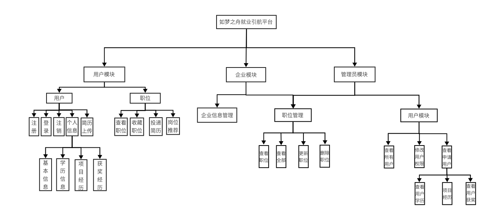
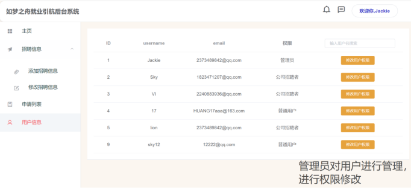
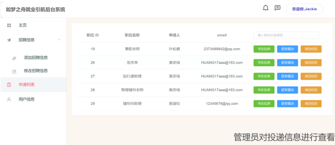
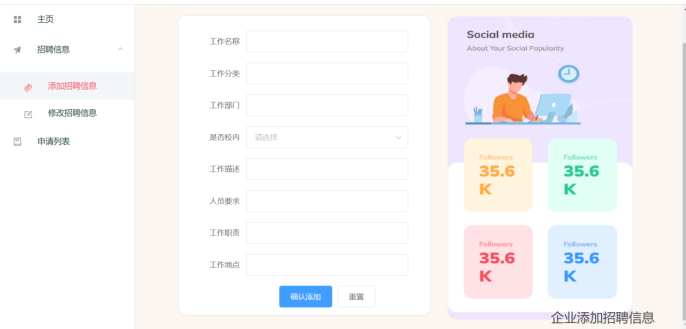
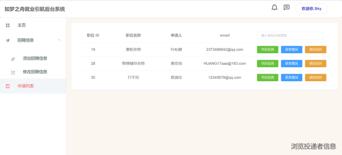
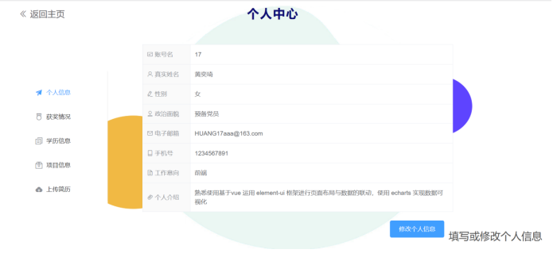

# 基于SpringBoot + vue 的校园招聘系统

#### 介绍
 基于SpringBoot和Vue的校园招聘系统是一个完整的招聘管理系统，主要功能包括企业发布招聘信息、学生浏览和应聘职位、管理员管理用户和系统资源等。此外，系统还采用了协同过滤算法，为学生推荐最符合其求职意愿和条件的职位，提高求职成功率。系统优点在于快速、高效和易用，同时具有良好的用户体验和数据安全性，能够实现真正的招聘、招聘管理和人才管理的综合管理。

#### 软件架构
 **Springboot 2.7.0**   **MyBatis-PLUS 3.5.0**   **SpringMVC**   **Vue** 

#### 重点难点
1.算法设计
协同过滤算法的设计：本项目使用的是基于物品的协同过滤算法，由于对算法设计的流程不熟悉，网上的推荐一般都是python调用库的方式实现，所以在设计过程中走了一定的弯路，查阅大量资料才总结出规律：

构建职位-用户矩阵—计算职位之间的相似度—推荐得分最高的前K个职位

计算职位相似度采用的是余弦相似度计算公式，推荐得分最高的职位需要排序，这里涉及到了Java的一些特有的比较方法，例如Collections的自带的排序方法，而且借助Comparator对象重写了排序规则。

2.Md5加密算法
首先只接收一个参数为password的参数，获取MessageDigest类的实例，该实例可以使用MD5算法进行加密；

接着将password字符串转化为字节数组，并计算该字节数组的MD5值；使用Java中的BigInteger类将计算出的MD5值转化为一个表示16进制的字符串；

如果MD5加密后的字符串不足32位，则在字符串的前面加上0，使其长度为32；最后返回MD5加密后的字符串。

3.文件上传设计
上传文件：上传文件并不是很难，但是这里涉及到了项目部署，部署到服务器之后，本地的路径就失效了，这里借助了Nginx反向代理技术将文件存储到服务器上。
#### 安装教程

 **1.1设备** 
a. 处理器：Intel Xeon E3-1100及以上，内存：16GB及以上。

b. 外存：SATA硬盘 7200r/m 4TB * 2 。

c. 网卡：Intel X540-2T及以上。

  **1.2支持软件** 
操作系统：Linux centos 7。 

数据库：MySQL8。 

服务器：Tomcat9。

编译：Java JDK11。

 **1.3接口** 
数据通信协议:HTTP/HTTPS，TCP/IP。

 **1.4控制** 
运行 

命令：java -jar xxx.jar

来源：bash

停止运行 

 **命令**  

获得PID：ps aux|grep xxx.jar 

停止运行：kill (1中获得的PID) PID
#### 使用说明

使用SpringBoot 2.7.0框架完成项目后端框架的搭建

使用Mybatis-Plus 3.5.0框架完成与数据库的交互

使用SpringMVC开源框架完成界面逻辑和应用程序分离

使用FastJSON（阿里巴巴JSON开源解析库）完成JSON对象的封装

使用Vue框架完成前端框架的搭建

使用ElementUI组件完成前端页面的快速布局

#### 演示效果

#### 最后

如果您需要，请关注我叭：[CSDN博主](http://lions.blog.csdn.net)
                        vx：2373489842